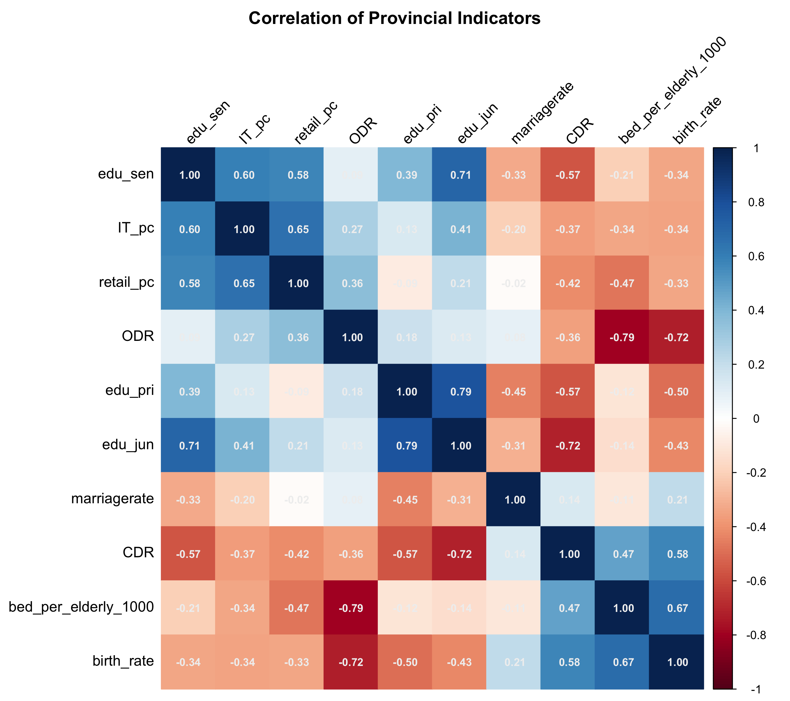
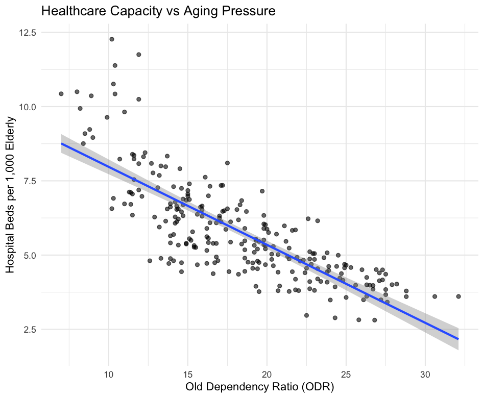

*Note: The following correlations are computed using pooled provincial panel data (2016–2024). These relationships reflect structural associations across provinces and time, and do not imply causal effects or within-province dynamic responsiveness.*

## Limitations

Before interpreting the findings, several limitations should be acknowledged.

1. **Non-causal interpretation**: Correlation analysis reflects structural associations and does not establish causal relationships.
2. **Short-run responsiveness**: Fixed-effects models capture within-province temporal adjustment during 2016–2024, but may not reflect long-term infrastructure planning cycles.
3. **Measurement scope**: Healthcare capacity is proxied by hospital beds per 1,000 elderly residents, which does not capture service quality, staffing adequacy, or efficiency.
4. **Potential omitted variables**: Fiscal expenditure, inter-provincial migration, urbanisation rate, and policy shocks are not explicitly modelled.

These limitations frame the analysis as a structural diagnostic rather than a definitive causal evaluation.

#### Basic Knowledge: Pearson R

| r Value range  | Relation Level |
|:---------------|:---------------|
| r ≥ 0.7        | Strong         |
| 0.5 ≤ r < 0.7  | Moderate       |
| r < 0.5        | Weak           |

## Indicator Construction Notes

To ensure clarity for readers, several indicators in this report are constructed variables derived from raw data.

- **bed_per_elderly_1000**: (medicalbed / elderpop) × 1000. Measures hospital beds per 1,000 elderly residents.
- **IT_pc**: IT_value / totpop. IT economic output per capita.
- **retail_pc**: retail_value / totpop. Retail consumption per capita.
- **edu_pri, edu_jun, edu_sen**: Defined as 1 / STR (student–teacher ratio) at primary, junior, and senior levels. A higher value indicates greater teacher availability per student.
- **ODR (Old Dependency Ratio)**: Ratio of elderly population to working-age population.
- **CDR (Children Dependency Ratio)**: Ratio of child population to working-age population.

All education indicators are transformed so that higher values consistently represent higher resource intensity, allowing interpretation to align across service dimensions.

| Variable A              | Variable B  |    r    | Direction | Interpretation                                            |
| :---------------------- | :---------- | :-----: | :-------: | :-------------------------------------------------------- |
| bed\_per\_elderly\_1000 | ODR         | −0.7930 |  Negative | Healthcare infrastructure has not kept pace with demographic aging          |
| edu\_pri                | edu\_jun    |  0.7850 |  Positive | Education quality is consistent across levels             |
| birth\_rate             | ODR         | −0.7247 |  Negative | High-birth provinces have younger populations             |
| edu\_jun                | CDR         | −0.7184 |  Negative | Higher child dependency is associated with lower teacher availability per student                |
| edu\_jun                | edu\_sen    |  0.7100 |  Positive | Education quality is consistent across levels             |
| bed\_per\_elderly\_1000 | birth\_rate |  0.6731 |  Positive | High-birth (younger) provinces have more beds per elderly |
| IT\_pc                  | retail\_pc  |  0.6546 |  Positive | Tech economy and consumption wealth move together         |
| IT\_pc                  | edu\_sen    |  0.5983 |  Positive | Tech-rich provinces have better senior high schools       |
| birth\_rate             | CDR         |  0.5788 |  Positive | More births → more child dependents (expected)            |
| retail\_pc              | edu\_sen    |  0.5758 |  Positive | Wealthier consumers → better senior high schools          |
| edu\_sen                | CDR         | −0.5695 |  Negative | Higher child dependency is associated with lower senior-level teacher availability        |
| edu\_pri                | CDR         | −0.5677 |  Negative | Higher child dependency is associated with lower primary-level teacher availability            |

## Finding 1: Structural Healthcare Imbalance Under Aging Pressure

***(r = −0.7930)***

The strongest relationship in the matrix is between bed_per_elderly_1000 and ODR (r = −0.7930), indicating a strong negative structural association across provinces.

Provinces with higher Old Dependency Ratios — meaning a greater burden of elderly dependents relative to the working-age population — tend to exhibit lower hospital bed availability per 1,000 elderly residents.

Importantly, this pattern reflects cross-provincial structural positioning rather than dynamic adjustment. Structurally older provinces appear to operate with comparatively lower elderly-adjusted healthcare capacity. The pooled scatter plot reinforces this pattern, with a clearly downward-sloping regression line.

This suggests persistent cross-regional imbalance in healthcare infrastructure relative to demographic aging pressure.

> Structural aging pressure is concentrated precisely where elderly-adjusted bed capacity is weakest.

## Finding 2: Provincial Demographic Bifurcation

***(r = −0.7247)***

The strong negative correlation between birth_rate and ODR (r = −0.7247) reveals a pronounced demographic divide across provinces.

While mechanically related through demographic structure, the magnitude of this relationship reflects a broader socioeconomic divide between two types of provinces. Less urbanised provinces tend to cluster on the high-birth, low-aging end of the spectrum, while highly urbanised and economically advanced provinces occupy the opposite end, characterised by low fertility and heavy aging pressure.

## Finding 3:  Internal Consistency of Educational Resource Indicators

***(r = 0.7850; 0.7100; 0.3923)***

The three education variables (edu_pri, edu_jun, edu_sen) display strong internal correlations, particularly between primary and junior levels (r = 0.7850) and junior and senior levels (r = 0.7100).

This indicates that teacher availability across educational stages tends to move together within provinces. Education resource intensity therefore appears to function as a coherent structural dimension rather than fragmented subcomponents.

Because of this high intercorrelation, subsequent panel regressions use a representative indicator to avoid multicollinearity and preserve model parsimony.

> Note: While creating Shiny app, do not necessarily need to show all three simultaneously; edu_jun (junior high) could serve as a reasonable single representative of the education dimension.

## Finding 4:  Youth Dependency and Educational Resource Strain

***(r = −0.7184, −0.5677, −0.5695)***

All three education indicators are negatively associated with CDR (Children Dependency Ratio), with the strongest relationship observed for edu_jun (r = −0.7184).

Structurally, provinces with higher child dependency burdens tend to exhibit lower teacher availability per student.

Again, this reflects cross-sectional structural positioning rather than confirmed dynamic responsiveness. The pattern suggests that youth-heavy provinces may experience comparatively lower educational resource intensity.

Whether this reflects insufficient supply adjustment or persistent structural capacity differences requires further dynamic analysis.

## Finding 5: Economic Development and Fertility Transition

***(r = −0.3404, −0.3339)***

IT_pc and retail_pc show weak-to-moderate negative correlations with birth_rate.

While not strong predictors, both indicators move consistently in the expected direction: provinces with more developed technological economies and higher consumer spending levels tend to exhibit lower fertility.

Compared with dependency ratios, however, economic development variables show weaker structural association with demographic pressure in this dataset.

## Finding 6: Institutional Independence of Marriage Rate

***(r = 0.21 with birth_rate; near zero with most others)***

marriagerate is the least integrated variable in the matrix. Its strongest correlation — with birth_rate — is modest (r = 0.2130), and its associations with economic and dependency indicators are weak.

This suggests that marriage behavior does not align predictably with demographic pressure or economic development in this framework.

Marriage dynamics likely operate under institutional, cultural, or housing-market influences not directly captured by dependency ratios or economic output indicators in this dataset.

Its relative structural independence makes it analytically distinct rather than redundant.

> When a user sees a province with an unusually high or low marriage rate on the map, they cannot simply explain it away by looking at the other variables. It demands its own investigation, which makes it a compelling standalone indicator.

## From Structural Association to Dynamic Responsiveness

The correlation analysis identifies cross-provincial structural imbalances but does not determine whether provinces adjust service supply in response to demographic pressure over time.

To examine within-province responsiveness, fixed-effects panel regressions are applied in the next section.

This approach isolates temporal variation within provinces while controlling for time-invariant regional characteristics and common year shocks.

## Fixed-Effects Evidence: Primary Focus on Healthcare Responsiveness

While the correlation analysis establishes structural imbalance, fixed-effects (two-way) panel estimation evaluates whether provinces dynamically adjust healthcare supply in response to changes in aging pressure over time.

### Primary Model: Aging Pressure on Healthcare Supply

The two-way fixed-effects model estimates the within-province relationship between Old Dependency Ratio (ODR) and elderly-adjusted bed capacity.

The coefficient on ODR is negative and statistically significant (p < 0.05), indicating that increases in aging pressure within a province are associated with reductions in hospital beds per 1,000 elderly residents.

This result is substantively important:

- The negative association is not merely structural (cross-sectional).
- It persists even after controlling for province fixed effects and common year shocks.
- Within provinces, healthcare supply does not expand in response to rising aging pressure.

This suggests limited dynamic responsiveness in healthcare infrastructure adjustment.

### Structural Positioning Visualised

The quadrant plot operationalises this imbalance:

- Bottom-right quadrant (High ODR, Low Beds): Structural misalignment zone.
- Top-left quadrant (Low ODR, High Beds): Relative surplus zone.

The concentration of provinces in the misalignment quadrant reinforces the regression finding that aging demand is not matched by proportional healthcare expansion.

---

## Supplementary Fixed-Effects Evidence

To assess whether similar responsiveness patterns appear in other service domains, additional two-way fixed-effects models were estimated.

### Education Responsiveness

The relationship between Children Dependency Ratio (CDR) and junior-level teacher availability (edu_jun) is negative and marginally significant (p ≈ 0.07).

This suggests that increases in youth dependency may be associated with slight reductions in teacher availability per student, though the statistical evidence is weaker than in healthcare.

Education adjustment appears limited, but less decisively so than healthcare.

### Marriage Rate and IT Development

The fixed-effects model examining marriage rate and IT development (IT_pc) shows no statistically significant relationship.

Unlike healthcare, marriage dynamics do not exhibit measurable responsiveness to economic structural change within provinces during the sample period.

---

## Overall Interpretation

Across domains, healthcare shows the clearest evidence of structural imbalance combined with weak dynamic adjustment.

Education exhibits mild signs of strain under demographic pressure, though evidence is less robust.

Marriage behavior appears institutionally independent from demographic and economic structural indicators in this framework.

Taken together, the results suggest that provincial service systems are not fully adapting to shifting demographic burdens, with healthcare representing the most pronounced misalignment.